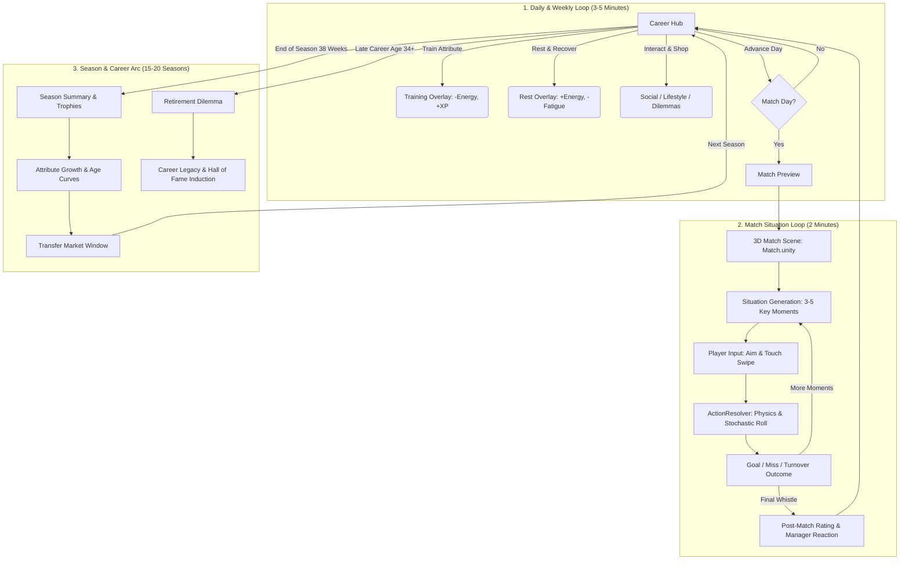

# Football Life — User Flow, Architecture & Gameplay Master Specification

**Status:** Phase 1–6 Complete (Production Release Candidate)  
**Target Engine:** Unity 6 (6000.2.0f1+) Universal Render Pipeline (URP)  
**Platform:** Mobile First (iOS / Android), Portrait Primary (9:16 / 1080×2400)  
**Architecture:** Strict Two-Layer Decoupling (`Domain` ↑ `Simulation` ↑ `Unity`)  

---

## 1. Core Fantasy & Player Attraction Hook

### The Core Fantasy
> **"You don't manage a football club. You live the life of a footballer."**

Unlike traditional management simulators (Football Manager) or team-controlling sports games (EA FC), **Football Life** places the player inside the boots of a single aspiring talent:
- **Personal Stardom & Lifestyle Aspiration:** Earn weekly wages, upgrade from a suburban shared flat to a skyline penthouse, collect supercars, and sign commercial sneaker endorsements.
- **Micro-Agency in Key Moments:** You do not play 90 minutes of virtual stick movements; you play the 3–5 pivotal match situations that define the match result (3D aimed free-kicks, through balls, sliding interceptions, close-range finishes).
- **Emergent Drama & Off-Pitch Dilemmas:** Navigate locker room friction, late-night party invitations, tabloid controversies, contract standoffs, and manager trust dynamics.
- **Bite-Sized Mobile Sessions:** A complete week of career decisions and a match situation can be played in **3 to 5 minutes**, perfect for commute and mobile gameplay.

---

## 2. Global Game Loops (Game Plan)



---

## 3. Comprehensive Screen Inventory & State Map

The game consists of **23 interconnected screen states** orchestrated through `CareerHubCoordinator.cs`, `SimulationBridge.cs`, and `SceneFlowManager.cs`:

```text
[Bootstrap.unity]
   │
   ├─► First Time? ──► [FTUE / Onboarding Flow] (Character Creation -> Tutorial Overlay)
   │
   └─► Returning?  ──► [MainMenu.unity] ──► [CareerHub.unity]
                                                   │
    ┌──────────────────────────────────────────────┴─────────────────────────────────────────────┐
    │                                                                                            │
[Football Operations]                                                                  [Lifestyle & Off-Pitch]
 ├─► Training Overlay (Drills, XP, Fatigue)                                              ├─► Rest & Apartment Overlay
 ├─► CareerView (League Table, Fixtures, Stats)                                          ├─► Lifestyle Shop (Watches, Cars, Homes)
 ├─► ProfileView (Abilities, International Caps)                                         ├─► Social Outings (Teammates, Friends)
 ├─► Transfer Market (Contract Offers, Wage Talks)                                       ├─► Life Dilemmas (Moral Choices)
 ├─► Continental View (Champions Cup Tournament)                                         ├─► Press Conference (Media Questions)
 ├─► Sponsorship Overlay (Endorsement Deals)                                             ├─► Smartphone OS (Chats, Social, News)
 ├─► Match Preview Screen                                                                └─► Legacy & Hall of Fame
        │
        ▼ (Scene Transition)
   [Match.unity]
    ├─► 3D Stadium Environment (Pitch, Floodlights, Crowd)
    ├─► MatchSituation HUD (Tactical Briefing, Choices)
    ├─► Touch Aiming Arc & Gesture Resolver
    └─► Post-Match Summary (Rating, Goals, Manager Trust Delta)
        │
        ▼ (Scene Transition)
   [CareerHub.unity]
```

### Screen Details & UI Elements

| Screen / Overlay | UXML / Unity Scene | Primary Purpose & Key Controls |
|---|---|---|
| **Bootstrap** | `Bootstrap.unity` | Engine startup, initial resolution/FPS setup (`MobilePerformanceManager`), loads persistent `SimulationBridge`. |
| **Onboarding (FTUE)** | `TutorialOverlayView.uxml` | 7-step guided tutorial: Player creation, position selection, first training, match debut, apartment rest, smartphone intro. |
| **Main Menu** | `MainMenu.unity` | New Career, Continue Career (multi-slot cloud save sync), Settings, Language Switcher (EN, ES, DE, FR, IT). |
| **Career Hub** | `CareerHubView.uxml` | **Central Hub:** Player avatar, OVR badge, Weekly calendar, Condition meters (Energy, Form, Morale, Trust), Next Match card, Advance Day button. |
| **Training Overlay** | `TrainingView.uxml` | Select drills (Finishing, Passing, Dribbling, Fitness). Visualizes attribute XP gains vs Energy cost and injury risk. |
| **Rest Overlay** | `RestView.uxml` | Sleep, hydrotherapy, and home relaxation. Recovers physical Energy and clears temporary Fatigue. |
| **Smartphone OS** | `PhoneOSView.uxml` | Dynamic mobile phone interface: **Messages** (Agent, Manager, Partner), **Feed** (Social media reactions), **News** (Headlines). |
| **Match Preview** | `MatchPreviewView.uxml` | Scouting report, opponent tactical identity, starting lineup status (Starter / Sub / Reserve), manager objectives. |
| **3D Match Action** | `Match.unity` | URP 3D pitch situation: dynamic broadcast camera, Humanoid pawns, swipe-to-kick trajectory, curve/spin mechanics, GK AI. |
| **Match Post** | `MatchPostView.uxml` | Performance grade (e.g. 8.4/10), match statistics, manager praise/criticism, trust and form adjustments. |
| **Transfer Market** | `TransferMarketView.uxml` | Browse suitor clubs, compare weekly wages, squad roles (Key Player, Rotation), release clauses, and submit contract demands. |
| **Lifestyle Shop** | `LifestyleShopView.uxml` | Purchase luxury assets (Apparel, Watches, Sports Cars, Mansions) to boost Lifestyle Tier, Morale, and Fame. |
| **Social Outings** | `SocialActivitiesView.uxml` | Team dinners, charity galas, VIP nightlife. Enhances teammate relationships and morale at the cost of fatigue. |
| **Press Conference** | `PressConferenceView.uxml` | Journalists ask context-sensitive questions after wins/losses. Select Humble, Confident, or Defiant answers. |
| **Champions Cup** | `ContinentalView.uxml` | 32-club continental tournament: 8 group stage standings, knockout bracket, prize money tracker. |
| **Sponsorships** | `SponsorshipView.uxml` | Review commercial endorsement offers (Boot deals, Energy drinks, Fashion brands) requiring minimum player reputation. |
| **Retirement & Legacy**| `LegacyView.uxml` | Career trophy room, Hall of Fame plaque, career grade calculation (GOAT, Legend, Icon, Journeyman), post-playing role selection. |

---

## 4. End-to-End Data Flow Architecture

The game strictly enforces the **Two-Layer Separation Principle** (`Domain` ↑ `Simulation` ↑ `Unity`):

```text
                      ┌──────────────────────────────────────┐
                      │            DATA STORAGE              │
                      │  content/data/*.json (Clubs, Leagues)│
                      │  Saves: Application.persistentData   │
                      └──────────────────┬───────────────────┘
                                         │ JSON Deserialization
                                         ▼
                      ┌──────────────────────────────────────┐
                      │             DOMAIN LAYER             │
                      │  Pure C# Models (Zero Unity Refs)    │
                      │  Player, Club, League, Match, Item   │
                      └──────────────────┬───────────────────┘
                                         │ Domain State
                                         ▼
                      ┌──────────────────────────────────────┐
                      │           SIMULATION LAYER           │
                      │  Deterministic Systems (SimRandom)   │
                      │  Training, MatchSim, Transfers, Life │
                      └──────────────────┬───────────────────┘
                                         │ State Snapshots & Events
                                         ▼
                      ┌──────────────────────────────────────┐
                      │          SIMULATION BRIDGE           │
                      │  MonoBehaviour Persistent Singleton  │
                      │  Dispatches C# Events & Action API   │
                      └──────────────────┬───────────────────┘
                                         │ UI Binding & Triggers
                      ┌──────────────────┴───────────────────┐
                      ▼                                      ▼
           ┌──────────────────────┐              ┌──────────────────────┐
           │   UI TOOLKIT VIEWS   │              │   3D MATCH RUNTIME   │
           │ UXML/USS UI Panels   │              │ Ball Physics, Rig,   │
           │ CareerHubCoordinator │              │ Humanoid Pawns, URP  │
           └──────────────────────┘              └──────────────────────┘
```

### Data Pipeline Details
1. **World State Initialization:**
   `WorldDataLoader.LoadFromDirectory("content/data")` loads **11 leagues** and **66 clubs** into pure C# `WorldState`.
2. **Weekly Loop Advancement:**
   When the player clicks **Advance Day**, `SimulationBridge` calls `CareerSimulationEngine.SimulateDay()`.
   - Modifies `PlayerState` (fatigue decay, energy replenishment).
   - Resolves active transfer window deadlines.
   - Evaluates weekly commercial sponsorship payouts.
   - Triggers pending stochastic life events or press conferences.
3. **Match Integration:**
   When a match day occurs:
   - `MatchSituationGenerator.GenerateSituations()` produces 3–5 high-stakes moments based on tactical disparity and player position.
   - Unity's `ShootingInteraction.cs` translates touch drag gestures into initial velocity $v = (v_x, v_y, v_z)$ and spin angular velocity $\omega$.
   - `ActionResolver.Resolve()` deterministically computes success probabilities and generates XP, confidence shifts, and trust adjustments.
4. **Persistence & Cloud Sync:**
   - Every state change triggers `SimulationBridge.AutoSave()`, saving a SHA-256 hashed binary/JSON payload to disk.
   - `CloudSaveSyncService` checks remote slots, detects conflicts, and synchronizes cross-device saves using deterministic `KeepNewest` strategies.

---

## 5. Player Agency & Decision Matrix

Every decision in Football Life involves **meaningful trade-offs** across 4 primary player currencies:

| Currency | What It Represents | High Value Consequence | Low Value Risk |
|---|---|---|---|
| **Energy / Fitness** | Short-term physical readiness | High physical burst in 3D situations | Muscle strains, forced substitution |
| **Fatigue** | Long-term accumulated exhaustion | Degrades all physical attributes by up to 30% | Keeps player at peak athletic baseline |
| **Manager Trust** | Coach's confidence in player | Unlocks Starting XI status and set-piece duties | Demoted to Bench or Reserve squad |
| **Bank Balance** | Liquid personal wealth | Unlocks top lifestyle tiers, cars, and investments | Cannot afford training coaches or luxury recovery |

### Decision Scenarios

```mermaid
graph LR
    subgraph Scenario1 ["Scenario 1: Friday Night Dilemma"]
        D1{Teammate invites you to a VIP party}
        D1 -->|Accept| R1A["+20 Morale, +Teammate Rel<br/>-25 Energy, +15 Fatigue"]
        D1 -->|Decline| R1B["+0 Energy Cost<br/>-5 Morale, -Teammate Rel"]
        D1 -->|Stay Home & Hydrate| R1C["+10 Energy Recovery<br/>Peak Saturday Condition"]
    end

    subgraph Scenario2 ["Scenario 2: Match Situation (88th Min)"]
        D2{Running into the penalty box, down 1-0}
        D2 -->|Power Shot Near Post| R2A["High Goal Probability if High Shooting<br/>Risk of GK block or miss"]
        D2 -->|Square Pass to Winger| R2B["High Success Rate, +Assist<br/>Relies on AI teammate conversion"]
        D2 -->|Dribble Past Keeper| R2C["Spectacular Highlight & +10 Trust<br/>High Risk of Turnover & Criticism"]
    end
```



---

## 6. Mobile Performance & Technical Standards

- **Target Frame Rate:** Dynamic throttling via [`MobilePerformanceManager.cs`](file:///Users/stavponte/Desktop/stav/projects/footbal-life/unity/FootballLife/Assets/Scripts/Core/Performance/MobilePerformanceManager.cs):
  - **60 FPS** during active 3D match gameplay situations.
  - **30 FPS** during UI Toolkit navigation, battery-saver mode, or when battery level drops $\le 20\%$.
- **Zero-GC Hot Paths:**
  - Zero heap allocations in `Update()`, `FixedUpdate()`, and match situation calculations (`ActionResolver.ComputeWeightedAbilityScore` allocates 0 bytes).
  - Pre-allocated object pools for match notifications, ball trails, and particle effects.
- **Memory Footprint:**
  - Retained world state (66 clubs, 11 leagues, rosters): **< 5 MB** (well below 10 MB budget).
  - Total mobile heap footprint target: **< 200 MB RAM**.
- **Localization:**
  - 100% key parity across 5 languages: **English (EN), Spanish (ES), German (DE), French (FR), Italian (IT)**.
- **Monetization Ethics:**
  - Cosmetic-only microtransactions (golden boots, retro kits, penthouses) and convenience tokens (Career Rewinds). No pay-to-win attribute scaling.

---

## 7. Current Project Status

| Area | Status | Verification Reference |
|---|---|---|
| **Domain Layer** | 100% Complete | Pure C# models across Player, Club, League, Contracts, Items, Legacy. |
| **Simulation Layer**| 100% Complete | Deterministic career, match, transfer, fatigue, and life event engines. |
| **Automated Tests** | 100% Passing | **676 / 676 tests passing** with 0 failures (`PerformanceBudgetTests`). |
| **Unity Presentation**| 100% Complete | UI Toolkit hub, 3D URP match scene, MobilePerformanceManager, Touch input. |
| **Release Validation**| Verified | `tools/verify_release_readiness.py` passed with 0 compiler warnings/errors. |

*This document serves as the master gameplay and architecture blueprint for the production release of Football Life.*
